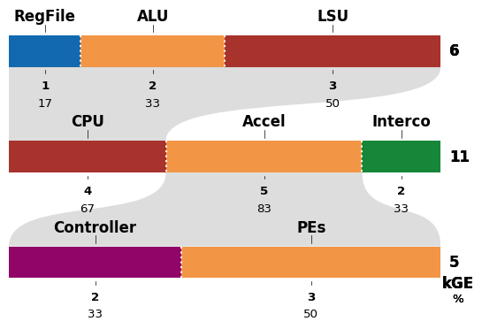

## Hierarchical Breakdown Plots

This repository contains a Python script to generate hierarchical breakdown bar plots, which are useful for visualizing the composition of hierarchical systems. An example is shown below:



## Usage

The easiest way to run the script is with `uv`:

```bash
uv run src/plot.py path/to/data.json --output /path/to/plot.pdf
```

Alternatively, you can install the dependencies manually with pip if you don't have them already:

```bash
pip install .
python src/plot.py path/to/data.json --output /path/to/plot.pdf
```

## Data Format

The input is a JSON file that specifies the data and configuration for the plot. An example data file is provided in `examples/data.json`. The data schema is defined in `src/data.schema.json`. A basic example is shown below:

```json
{
    "colors": {
        "MyRed"             : "#A8322C",
        "MyBlue"            : "#1269B0",
        "MyGreen"           : "#168638",
        "MyOrange"          : "#F29545",
        "MyPurple"          : "#910569",
        "MyOlive"           : "#48592C",
        "MyMarine"          : "#007996",
        "MyGray"            : "#ABABAB",
    },
    "si_unit" : "kGE",
    "bars": {
        "CPU": {
            "labels": ["RegFile", "ALU", "LSU"],
            "values": [1, 2, 3],
            "num_elements": [4, 1, 1],
            "colors": [{"$ref": "#/colors/MyBlue"}, {"$ref": "#/colors/MyOrange"}, {"$ref": "#/colors/MyRed"}],
            "parent": "System:4xCPU:2"
        },
        "System" : {
            "labels": ["4xCPU", "Accel", "Interco"],
            "values": [6, 3, 2],
            "colors": [{"$ref": "#/colors/MyRed"}, {"$ref": "#/colors/MyOrange"}, {"$ref": "#/colors/MyGreen"}]
        },
        "Accel" : {
            "labels": ["Controller", "PEs"],
            "values": [2, 3],
            "colors": [{"$ref": "#/colors/MyPurple"}, {"$ref": "#/colors/MyOrange"}],
            "parent": "System:Accel"
        }
    }
}
```

The `plot.py` will plot the `bars` in the same order from top to bottom. Each bar can optionally specify a `parent` to indicate hierarchical relationships, which will be shown with shades. For instance, `parent: "System:CPU"` indicates that the current bar is the breakdown of the `CPU` section of the `System` bar.

There are additional configuration options available under the `fig` section, such as `fontsize`, `fontfamily`, `ratio`, `scale`, and `bar_height`. Please refer to the schema for more details.
